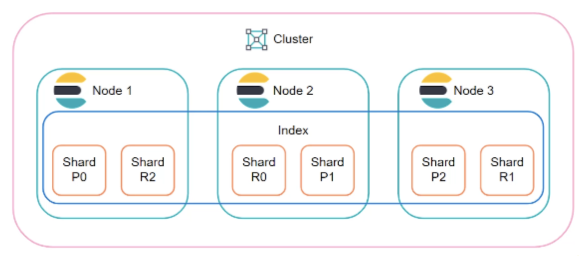
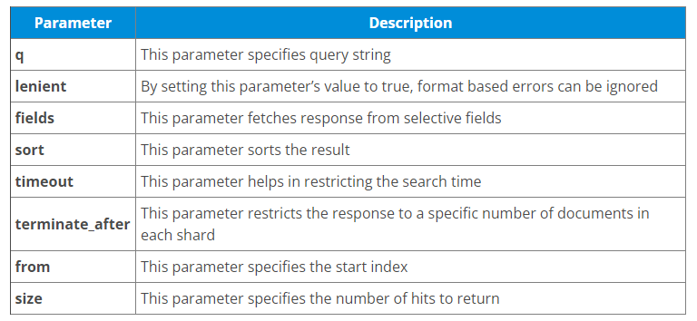
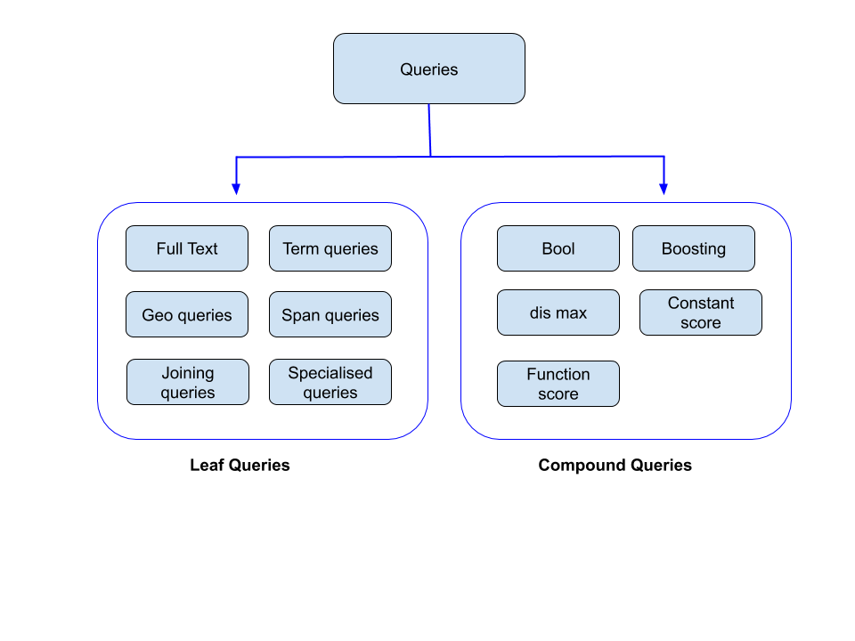

 <div align="center" dir = "ltr">
 
 
  
</div>

## معرفی
<div align="right" dir = "rtl">
 Elastic search یک موتور جستجو یا به بیانی دیگر پایگاه‌ داده‌ای از جنس document oriented یا nosql است.
 جالب است بدانید از این موتور جستجو در طراحی سایت‌های معروفی چون StackOverFlow، Wikipedia و Github نیز استفاده شده است.
 این ابزار توسط زبان جاوا توسعه یافته و برای درک بهتر این آموزش بهتر است با مفاهیمی چون json, search engine و زبان برنامه‌نویسی جاوا آشنا باشید.
 <br> 
 
 ## نصب
 قدم اول: باید جاوا با ورژن حداقل 7 در سیستم عامل شما نصب باشد. دستورات زیر برای چک کردن در ویندوز و Unix آورده شده‌اند.
<div align="left" dir = "ltr">
  
```
> java -version
$ echo $JAVA_HOME
```
</div>
 قدم دوم: از سایت www.elastic.co نسخه مربوط به سیستم‌عامل خود را دریافت کرده و نصب کنید.  <br>
 قدم سوم: به محل نصب بروید و دستور زیر را اجرا کنید.


 <div align="left" dir = "ltr">
In Windows
  
```
> cd elasticsearch-x.x.x/bin
> elasticsearch
```
In Linux
```
$ cd elasticsearch-x.x.x/bin
$ ./elasticsearch
```
 </div>
 
 اگر در ویندوز با خطای مربوط به JAVA_HOME مواجه شدید در بخش environment variables ها Path مروبط به jre نصب شده را قرار دهید.
 <br>
 قدم چهارم: پورت پیش‌فرض برای Elasticsearch، 9200 می‌باشد که اگر در browser خود http://localhost:9200 را وارد کنید عبارت json زیر را مشاهده خواهید کرد.(برای تغییر پورت باید مقدار http.port را در فایل elasticsearch.yml تغییر دهید.)
  <div align="left" dir = "ltr">
In Windows
  
```
{
   "name" : "Brain-Child",
   "cluster_name" : "elasticsearch", "version" : {
      "number" : "2.1.0",
      "build_hash" : "72cd1f1a3eee09505e036106146dc1949dc5dc87",
      "build_timestamp" : "2015-11-18T22:40:03Z",
      "build_snapshot" : false,
      "lucene_version" : "5.3.1"
   },
   "tagline" : "You Know, for Search"
}
```
 </div>
 قدم پنجم: حال که از نصب Elasticsearch مطمئن شده‌ایم به نصب kibana می‌پردازیم، که یک اپلیکیشن frontend در سطح بالایی elasticsearch است که امکان جستجوی راحت تر و مصور کردن داده ها را می‌دهد.
 
<div align="left" dir = "ltr">
 
In Linux
```
wget https://artifacts.elastic.co/downloads/kibana/kibana-7.0.0-linuxx86_64.tar.gz

tar -xzf kibana-7.0.0-linux-x86_64.tar.gz

cd kibana-7.0.0-linux-x86_64/

./bin/kibana
```
</div>
 برای ویندوز نیز از سایت  https://www.elastic.co/products/kibana. آن را دانلود کرده و kibana.bat را اجرا می‌کنیم.
 
 ## مثال ساده
 در اولین قدم می‌خواهیم populate کردن این موتور را یاد بگیریم.
 فرض کنید می‌خواهیم اطلاعات مربوط به دانشجویان را نگهداری کنیم، پس یک index به نام student می‌سازیم.
<div align="left" dir = "ltr">
 
```
PUT student
# response => {
  "acknowledged": true,
  "shards_acknowledged": true,
  "index": "student"
}
```
</div>
حال داده های زیر را که لزوما Key های یکسانی ندارند را می‌توانیم به این Index اضافه کنیم.
 <div align="left" dir = "ltr">
 
```
POST student/_doc/5
  {
     "f_name": "Jamshid", "l_name": "Jamshidi", "student_number":99101010,
     "overall_grade":12.1, "grades":[12.0, 12.1, 12.2], "University":"Sharif"
  }
  POST student/_doc/3
  {
     "f_name": "Mona", "l_name": "Jamshidi", "student_number":90909090,
     "department":"CS", "gender":"female", "university":"Tehran"
  }
```
</div>
 دستورات بالا در واقع دو آبجکت از جنس json را در Index ایجاد کردند و شماره‌ی id مربوط به آن را بعد از doc_ که به موتور می‌فهماند قرار است یک document ایجاد شود می‌نویسیم.
 <br>
 اگر هم id را خودمان تعریف نکنیم به صورت اتوماتیک تولید می‌شود و در response بعد از اجرای کد با همچین خروجی مواجه خواهید شد.
 <br>
 
<div align="left" dir = "ltr">
 
```
"_id": "PVghWGoB7LiDTeV6LSGu"
```
</div>

 حال با دستور زیر تمامی آبجکت‌هایی که در دانشگاه تهران هستند را دریافت می‌کنیم.
 
 
  <div align="left" dir = "ltr">
 
```
GET /_all/_search?q=university:tehran 
# result =>
  {
...
    "hits": [
      {
        "_index": "student",
        "_id": "3",
        "_score": 0.2876821,
        "_source": {
          "f_name": "Mona",
          "l_name": "Jamshidi",
          "student_number": 90909090,
          "department": "CS",
          "gender": "female",
          "university": "Tehran"
...
```
</div>
 
 حال که با کلیت کار آشنا شدیم در ادامه به توضیح مفاهیم اصلی Elasticsearch می‌پردازیم.
 
 ## 4 عنصر اصلی
 در این بخش یه معرفی چهار مفهوم Cluster، Node، Index , shard می‌پردازیم. 
 <br>
 مثال ساده‌ی بالا را در نظر بگیرید. در ابتدا که وارد کنسول برنامه شدیم یک Node توسط elasticsearch ساخته شد. یک Node نیاز به یک Cluster یا شاخه دارد تا عضو آن شود، پس اگر تعریف نکرده باشیم که نکردیم خودش یکی می‌سازد. در ادامه ما یک index برای دانشجو ساختیم که اگر نمی‌ساختیم و مستقیما اطلاعات را POST می‌کردیم نیز یک index ساخته می‌شد.با ساخته شدن هر index تعدادی shard به وجود می‌آید که نگهدارنده‌ی داده‌های ما هستند. به طور پیشفرض 5 shard ساخته شده. shard ها کوچکترین عنصر موتور ما هستند و به وجود تعدادی از آن‌ها برای پردازش موازی نیاز است. به شکل زیر دقت کنید. یک index زیر مجموعه‌ی node نیست بلکه می‌تواند چندتا از آن‌ها را در بر بگیرید، و این توزیع به صورت مساوی انجام می‌پذیرد. مثلا الان که 5 shard داریم 3 تا از آن‌ها توسط node 1 و 2 تای دیگر توسط node 2 نگهداری و پردازش می‌شود. 
 <br>

عبارت مهم دیگری که باید از این قسمت بدانید replica است که درواقع نوعی shard است. معنی این کلمه به معنای کپی برابر اصل است و عملکرد آن نیز به همین گونه می‌باشد. مقدار پیش‌فرض آن یک است پس برای هر shard یک کپی داریم و محل ذخیره‌ی آن یک Node به غیر از محل ذخیره‌ی نمونه‌ی اصلی استدر غیر این صورت مانند این است که فایل backup را در همان حافظه‌ای قرار دهیم که فایل اصلی است! 
 ## کار با Index
 در قسمت قبل با shard و replica آشنا شدیم. در این بخش به‌کارگیری آن‌ها در ساخت index را بررسی می‌کنیم.
 <br>
 با دستور زیر می‌توان یک index از فیلم‌های سینمایی با 8 تا shard و 2 تا replica ایجاد کرد.
 
 <div align="left" dir = "ltr">
 
```
PUT movies
{
  "settings" : {
      "index" : {
         "number_of_shards" : 8,
         "number_of_replicas" : 2
      }
   }
}
```
</div>
دریافت اطلاعات کلی index ساخته شده را با دستور زیر انجام می‌دهیم.
  <div align="left" dir = "ltr">
 
```
GET movies
# results => {
   ...
   "number_of_shards": "8",
    "provided_name": "movies",
    "creation_date": "1676183104138",
    "number_of_replicas": "2",
    "uuid": "n52sOXtiTgiuntfq03ePWg",
   ...
   }
```
</div>
برای حذف کردن یک index هم داریم:
  <div align="left" dir = "ltr">
 
```
DELETE movies
```
</div>
 برای بررسی اینکه یک index وجود دارد یا خیر درخواست زیر را می‌فرستیم. اگر نتیجه کد 200 بود یعنی index یافت شده و در غیر این صورت پیغام 404 مشاهده می‌شود.
   <div align="left" dir = "ltr">
 
```
HEAD movies
#rsults => {
  "statusCode": 404,
  "error": "Not Found",
  "message": "404 - Not Found"
}
```
</div>
 گاهی نیز  نمی‌خواهیم index را حذف کنیم و فقط دسترسی نوشتن و خواندن از آن را قطع کنیم که با درخواست‌های زیر امکان‌پذیر است.
<div align="left" dir = "ltr">
 
```
POST /movies/_close
 
POST /movies/_open
```
</div> 
 برای دسترسی به index با چند نام از مفهوم Aliasing استفاده می‌کنیم.
 <div align="left" dir = "ltr">
 
```
POST /_aliases
{
 "actions" : [
 { "add" : { "index" : "movies", "alias" : "films" } }
 ]
}
 
POST /_aliases
{
 "actions" : [
 { "remove" : { "index" : "movies", "alias" : "films" } }
 ]
}
```
</div> 
 
 ## کار با cluster و node
 در این قسمت به API های مربوط به cluster و node می‌پردازیم.

<br>
مهمترین API های cluster مربوطه به وضعیت آن است.
 
 <br>
 برای بررسی سلامت cluster از دستور زیر استفاده می‌کنیم.
  <div align="left" dir = "ltr">
 
```
GET _cluster/health
```
</div> 
 در پاسخ دریافتی عبارت status با سه رنگ سبز، زرد و قرمز مقداردهی می‌شود. سبز به معنی این است که shard ی وجود ندارد که به Index ی اختصاص نیافته باشد، زرد نیز همین مورد را درباره‌ی replica ها بررسی می‌کند و در غیر این صورت وضعیت قرمز خواهد بود.
 <br>
 برای دریافت تمامی اطلاعات دیگر نیز می‌توان از دستورات زیر استفاده کرد.
   <div align="left" dir = "ltr">
 
```		
GET /_cluster/state
GET /_cluster/stats
```
</div> 
 
 اما درباره‌ی Node اگر بخواهیم ببینیم از هر کدام چندبار و چه موقع استفاده شده است از دستور زیر استفاده می‌کنیم. در قسمت timestamps زمانی که این node مورد ایجاد را نشان داده و Since زمانی که دیتایی را نگه داشته را نشان می‌دهد.search_action هم تعداد دفعات رجوع به این node را نشان می‌دهد.
 .
   <div align="left" dir = "ltr">
 
```		
GET _nodes/usage
#results => "nodes": {
    "pQHNt5rXTTWNvUgOrdynKg": {
      "timestamp": 1492553961812, 
      "since": 1492553906606, 
      "rest_actions": {
        "nodes_usage_action": 1,
        "create_index_action": 1,
        "document_get_action": 1,
        "search_action": 19, 
        "nodes_info_action": 36
      },
```
</div>

 ## Search API
این نوع درخواست را با GET می‌فرستیم و سپس همانطور که در مثال زیر آمده index های موردنظر یا_all_ را قرار می‌دهیم. بعد از اسلش کلیدواژه‌ی serach_ را داریم که نوع API را تعیین می‌کند و بعد از علامت سوال یک سری paramter داریم که در جدول زیر تمامی آن‌ها با کاربردشان آمده‌اند. 
 
 <div align="center" dir = "ltr">
 
 
  
</div>
 
 در مثال زیر به دو index درخواست می‌فرستیم و 20 تا از کسانی که اسمشان علی است را به ما در پاسخ می‌فرستد. 
  <div align="left" dir = "ltr">
 
```		
GET student,teacher/_search?q=first_name:ali&size=20
```
</div>
 
## Aggregation
 به معنای تجمیع کردن است و به خلاصه‌سازی داده ها در سه نوع metric، bucket و pipeline می‌پردازد. برای درک بهتر مثال های زیر را در نظر بگیرید.
 * میانگین نمرات دانشجویان.
 * تعداد فیلم‌های تاریخی در پایگاه‌داده.
 * میانگین بار زمانی روی سیستم.
 <br>
 مثلا در پاسخ به سوال اول از aggregation average که از نوع metric است استفاده می‌کنیم. در ادامه هر کدام از سه بخش را با مثال توضیح می‌دهیم.
 ### metric
 فرض کنید یک index به نام امتحان داریم و می‌خواهیم به search api آن قابلیت‌هایی چون میانگین، حداکثر یا حداقل گرفتن، مجموع گرفتن و ... را اضافه کنیم. دستور زیر این قابلیت را به ما می‌دهد که هر بار که درخواست search فرستادیم میانگین نمرات هم در پاسخ ارسال شود.
 
   <div align="left" dir = "ltr">
 
```		
POST /exams/_search?size=0
{
  "aggs": {
    "avg_grade": { "avg": { "field": "grade" } }
  }
}
```
</div>
 
 برای آشنایی با تمامی امکانات metric aggregation به سایت https://www.elastic.co/guide/en/elasticsearch/reference/current/search-aggregations-metrics.html مراجعه کنید.
 
 ### Bucket
  این نوع aggregation به محاسبه‌ی کممیت‌ها نمی‌پردازد و درواقع یک bucket یا ظرفی از document های ما می‌شود. به عنوان مثال اگر ما index مربوط به یک سری موزیک داشته باشیم که هر کدام ژانر مشخصی دارند و می‌خواهیم با یک درخواست GET بقهمیم از هر ژانر چند موسیقی وجود دارد. دقت کنید که می‌توانستیم از متد POST استفاده کنیم و این فیلد را در index ایجاد کنیم ولی در این مثال نیازی نیست چون بار اضافی است.
 
  <div align="left" dir = "ltr">
 
```		
GET /musics/_search
{
  "aggs": {
    "genres": {
      "terms": { "field": "genre" }
    }
  }
}
```
</div>
 در ابتدا مشخص کردیم که می‌خواهیم یک aggregation داشته باشیم و فیلد genres اضافه شود که terms مانند avg در قسمت قبل از زیرمتدهای Bucket aggregation است، بعد هم مشخص می‌کنیم که چه فیلدی از index مد نظر باید بررسی شود. خروجی به شکل زیر می‌شود.
  <div align="left" dir = "ltr">
 
```		
{
  ...
  "aggregations": {
    "genres": {
      "doc_count_error_upper_bound": 0,   
      "sum_other_doc_count": 0,           
      "buckets": [                        
        {
          "key": "electronic",
          "doc_count": 6
        },
        {
          "key": "rock",
          "doc_count": 3
        },
        {
          "key": "jazz",
          "doc_count": 2
        }
      ]
    }
  }
}
```
</div>
 برای اطلاعات بیشتر در این موضوع به https://www.elastic.co/guide/en/elasticsearch/reference/current/search-aggregations-bucket.html مراجعه کنید.
 
 ### Pipeline
Pipeline aggregation
 به جای کار کردن بر document ها روی خروجی‌های دیگر aggregation ها اعمال می‌شود.
## Query
 از مهمترین بخش‌های کار با پایگاه‌داده‌ها Query زدن می‌باشد که در elasticsearch از دو نوع leaf query و compound query است.
 
 
</div>
